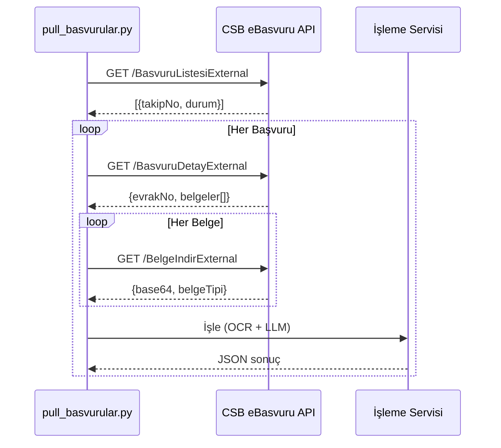

# Sanayide Yeşil Dönüşüm Başvuru Değerlendirme Sistemi

CSB eBasvuru API entegrasyonu ile otomatik belge analizi ve başvuru değerlendirme sistemi.

## 📋 Özellikler

- ✅ CSB eBasvuru API entegrasyonu
- ✅ Otomatik belge çekme ve saklama
- ✅ OCR ile metin çıkarma (EasyOCR)
- ✅ Ollama LLM ile belge analizi
- ✅ Sektör deneyimi hesaplama
- ✅ Yapılandırılmış SQLite veritabanı
- ✅ Belge tipi otomatik tahmin
- ✅ Zorunlu belge kontrolü
- ✅ Chunk-based büyük belge işleme
- ✅ Analiz performans takibi
- ✅ Streamlit web arayüzü

## 🏗️ Proje Yapısı

```
ebasvuru/
├── app/                  # Mevcut uygulama (eski yapı - uyumlu)
│   ├── core/             # Belge işleme, OCR, LLM
│   ├── models/           # Pydantic şemalar
│   ├── prompts/          # LLM prompt şablonları
│   └── services/         # API clientlar
│
├── config/               # YENİ: Merkezi konfigürasyon
│   ├── __init__.py
│   └── settings.py       # Global ayarlar
│
├── database/             # YENİ: Veritabanı şemaları
│   ├── schema.sql        # Tam SQL şeması
│   └── migrations/       # Migration scriptleri
│
├── models/               # YENİ: ORM-benzeri model sınıfları
│   ├── database.py       # DB yönetimi
│   ├── basvuru.py        # Başvuru modeli
│   ├── belge.py          # Belge modeli
│   └── analiz_sonuc.py   # Analiz sonucu modeli
│
├── scripts/              # Yönetim scriptleri
│   ├── init_database.py       # YENİ: Veritabanı başlat
│   ├── migrate_database.py    # YENİ: Eski DB -> Yeni şema
│   ├── check_db_schema.py     # YENİ: Şema kontrolü
│   ├── sync_data_to_db.py     # API'den veri çek
│   └── analyze_from_db.py     # Başvuruları analiz et
│
├── data/                 # Veriler (gitignore)
│   ├── basvurular.db     # SQLite veritabanı (9.77 GB)
│   └── exports/          # Raporlar
│
├── logs/                 # Log dosyaları (gitignore)
├── temp/                 # Geçici dosyalar
├── viewer/               # Streamlit web arayüzü
│
├── .env                  # Konfigürasyon
├── requirements.txt      # Python bağımlılıkları
└── README.md
```

## 🚀 Kurulum

### 1. Python Ortamını Hazırlama

```bash
# Virtual environment oluştur
python -m venv venv

# Aktif et (Windows)
venv\Scripts\activate

# Aktif et (Linux/Mac)
source venv/bin/activate

# Bağımlılıkları yükle
pip install -r requirements.txt
```

### 2. Konfigürasyon

```bash
# .env dosyası oluştur (yoksa)
copy .env.example .env

# .env dosyasını düzenle
notepad .env
```

Gerekli ayarlar:
```env
# Ollama
OLLAMA_URL=http://localhost:11434
OLLAMA_MODEL=llama3.2-vision:latest
OLLAMA_TIMEOUT=180

# API (CSB eBasvuru)
EXTERNAL_API_URL=https://test-ebasv-s.csb.gov.tr
EXTERNAL_API_USERNAME=yapayzeka
EXTERNAL_API_PASSWORD=your_password_here

# Chunk ayarları
CHUNK_SIZE=4000
CHUNK_OVERLAP=200

# Debug
DEBUG=false
LOG_LEVEL=INFO
```

### 3. Ollama Kurulumu

```bash
# Ollama'yı indir ve kur
# https://ollama.com

# Vision model indir (belge analizi için)
ollama pull llama3.2-vision:latest
```

### 4. Veritabanını Başlat

#### Seçenek A: Sıfırdan Yeni Veritabanı

```bash
# Yeni şema ile DB oluştur
python scripts/init_database.py
```

#### Seçenek B: Mevcut Veriyi Migrate Et (ÖNERİLEN)

```bash
# Eski şemayı kontrol et
python scripts/check_db_schema.py

# Mevcut veriyi yeni şemaya aktar
python scripts/migrate_database.py
```

Migration sonrası:
- Yedek: `data/basvurular_backup_YYYYMMDD_HHMMSS.db`
- Yeni DB: `data/basvurular_v2.db`
- Eski DB: `data/basvurular.db` (değişmedi)

## 🧪 Test

### API Bağlantı Testi

```bash
python scripts/test_external_api.py
```

Çıktı:
```
======================================================================
CSB eBasvuru API Test
======================================================================

1️⃣  HİZMET LİSTESİ TEST
----------------------------------------------------------------------
✅ Status: 200
✅ Toplam: 45 hizmet

İlk 5 Hizmet:
  1. ID: 10256 - Uzman Başvurusu
  ...

2️⃣  BAŞVURU LİSTESİ TEST
----------------------------------------------------------------------
✅ Status: 200
✅ Toplam: 12 başvuru

İlk Başvuru Detayları:
  Takip No     : TK-2025-001
  Hizmet       : Uzman Başvurusu
  Durum        : Beklemede
  Tarih        : 2025-10-06
```

## 📥 Kullanım

### 1. API'den Başvuru Çekme

```bash
# Tüm hizmetlerdeki başvuruları çek ve DB'ye kaydet
python scripts/sync_data_to_db.py

# Belirli bir hizmetteki başvuruları çek
python scripts/sync_data_to_db.py --hizmet-id 10307
```

### 2. Başvuruları Analiz Etme

```bash
# İlk 10 başvuruyu analiz et
python scripts/analyze_from_db.py --limit 10

# Belirli bir başvuruyu analiz et
python scripts/analyze_from_db.py --takip-no 5931381

# Tüm işlenmemiş başvuruları analiz et
python scripts/analyze_from_db.py
```

Analiz sonuçları:
- DB'ye kaydedilir: `analiz_sonuclari` tablosu
- Loglar: `llm_logs/{takip_no}/`
- Geçici dosyalar: `temp/analiz/{takip_no}/`

### 3. Web Arayüzünden Görüntüleme

```bash
# Streamlit viewer başlat
streamlit run viewer_app.py
```

Web tarayıcıda açılır: `http://localhost:8501`

## 🔄 Çalışma Modları

### Mod 1: Manuel İşleme (MVP)

```bash
# Tüm bekleyen başvuruları çek ve işle
python scripts/pull_basvurular.py
```

### Mod 2: Otomatik Scheduler (Gelecek)

```python
# app/main.py içinde
from app.services.scheduler_service import BasvuruScheduler

scheduler = BasvuruScheduler()
scheduler.start()  # Her 15 dakikada bir otomatik çeker
```

## 🔌 API Endpoints

### Harici API (CSB eBasvuru)

| Endpoint | Method | Açıklama |
|----------|--------|----------|
| `/Hizmet/HizmetListesiExternal` | GET | Hizmet listesi |
| `/Basvuru/BasvuruListesiExternal` | GET* | Başvuru listesi |
| `/Basvuru/BasvuruDetayExternal` | GET | Başvuru detayı |
| `/Basvuru/BelgeIndirExternal` | GET | Belge indirme |
| `/Basvuru/DegerlendirmeSonucGonder` | POST | Sonuç gönderme |

*Not: GET ama JSON body ile gönderilir!*

## 📊 Veri Akışı



## 📊 Veritabanı Şeması

### Ana Tablolar

1. **basvurular** - Başvuru bilgileri (2,088 kayıt)
   - `basvuruId`, `takipNo`, `hizmetId`, `basvuruTarihi`
   - `basvuruYapanAd`, `basvuruYapanSoyad`, `basvuruYapanVatandasTC`
   - `basvuruDurum`, `kararDurum`
   - `json_ham` (ham JSON saklanır)
   - `islendiMi`, `islenme_suresi_sn`

2. **belgeler** - Belge dosyaları
   - `belgeId`, `basvuruId` (FK)
   - `belgeAdi`, `belgeTipi`, `belgeTipi_tahmini`
   - `belgeIcerik` (Base64)
   - `belge_boyutu_bytes`, `belge_uzantisi`
   - `analiz_edildi`, `analiz_suresi_sn`

3. **analiz_sonuclari** - Analiz sonuçları
   - Sektör başvuruları: `sektor_enerji`, `sektor_metal`, ...
   - Sektör tecrübeleri: `tecrube_enerji`, `tecrube_metal`, ...
   - Adli sicil: `adli_sicil_varmi`, `adli_sicil_kodu`
   - Eğitim: `mezun_universite`, `mezun_bolum`, `mezuniyet_yili`
   - İş deneyimi: `toplam_is_deneyimi_yil`, `toplam_is_deneyimi_ay`
   - Projeler: `proje_yayin_sayisi`
   - Uygunluk: `zorunlu_belgeler_tam`, `eksik_belgeler`

4. **proje_yayinlar** - Proje/yayın detayları
5. **belge_analiz_log** - Analiz logları
6. **chunk_sonuclari** - Chunk analiz sonuçları
7. **sistem_config** - Sistem ayarları
8. **belge_tipi_kurallar** - Belge tipi tahmin kuralları
9. **zorunlu_belgeler** - Hizmet bazlı zorunlu belgeler

### View'lar (Raporlama)

- `v_basvuru_ozet` - Başvuru özet raporu
- `v_sektor_dagilim` - Sektör dağılımı
- `v_analiz_performans` - Analiz performans metrikleri

## 🔑 Konfigürasyon

| Parametre | Açıklama | Varsayılan |
|-----------|----------|------------|
| `OLLAMA_URL` | Ollama API URL | http://localhost:11434 |
| `OLLAMA_MODEL` | Ollama model | llama3.2-vision:latest |
| `OLLAMA_TIMEOUT` | API timeout (saniye) | 180 |
| `CHUNK_SIZE` | Chunk karakter sayısı | 4000 |
| `CHUNK_OVERLAP` | Overlap karakter sayısı | 200 |
| `EXTERNAL_API_URL` | CSB eBasvuru API URL | test-ebasv-s.csb.gov.tr |
| `EXTERNAL_API_USERNAME` | API kullanıcı adı | yapayzeka |
| `EXTERNAL_API_PASSWORD` | API şifre | (env'den) |
| `LOG_LEVEL` | Log seviyesi | INFO |
| `DEBUG` | Debug modu | false |

Tüm ayarlar: `config/settings.py`

## 🐛 Hata Ayıklama

### API Bağlantı Hatası

```bash
# Bağlantı testi
curl -u yapayzeka:PASSWORD https://test-ebasv-s.csb.gov.tr/Hizmet/HizmetListesiExternal
```

### Ollama Bağlantı Hatası

```bash
# Ollama çalışıyor mu?
ollama list

# Model var mı?
ollama pull gemma3:27b
```

### Log Seviyesi Değiştirme

```bash
# .env dosyasında
LOG_LEVEL=DEBUG
```

## 🎯 Hizmet Tipleri

Sistem 6 farklı hizmet tipini destekler:

| Kod | Hizmet Adı | Kategori |
|-----|------------|----------|
| 10307 | Sanayide Yeşil Dönüşüm Sorumlusu | Akademisyen |
| 10308 | Sanayide Yeşil Dönüşüm Sorumlusu | Eski Bakanlık Personeli |
| 10309 | Sanayide Yeşil Dönüşüm Sorumlusu | Sektör Çalışanı |
| 10310 | Sanayide Yeşil Dönüşüm Baş Sorumlusu | Akademisyen |
| 10311 | Sanayide Yeşil Dönüşüm Baş Sorumlusu | Eski Bakanlık Personeli |
| 10312 | Sanayide Yeşil Dönüşüm Baş Sorumlusu | Sektör Çalışanı |

### Belge Tipleri

**Zorunlu Belgeler (Genel):**
- Yök Lisans Diploması
- SGK Hizmet Dökümü
- Adli Sicil Kaydı
- Özgeçmiş/CV
- Fotoğraf (vesikalık)

**Akademisyen için Ek Zorunlu:**
- Hitap Hizmet Dökümü
- Proje Dosyası (1) - Baş Sorumlu için (1), (2), (3)

**Sektör Belgeleri (Opsiyonel):**
- Enerji Üretimi
- Metal Üretimi ve İşlemesi
- Mineral Endüstrisi
- Kimya Endüstrisi
- Atık Yönetimi
- Diğer Üretim Faaliyetleri

## 🔧 Yönetim Komutları

```bash
# Veritabanı kontrolü
python scripts/check_db_schema.py

# Veritabanı başlat (yeni)
python scripts/init_database.py --force

# Migration (eski -> yeni)
python scripts/migrate_database.py

# Başvuru istatistikleri
python -c "from models import Basvuru; print(Basvuru.get_statistics())"

# Belge istatistikleri
python -c "from models import Belge; print(Belge.get_statistics())"
```

## 📝 TODO

- [ ] Services klasörüne yeni servisler ekle
- [ ] Analyzers klasörüne belge analyzer'ları ekle
- [ ] Utilities klasörüne helper fonksiyonlar ekle
- [ ] Otomatik scheduler servisi
- [ ] REST API endpoint'leri
- [ ] Unit testler
- [ ] Docker container
- [ ] Performans optimizasyonu

## 📄 Lisans

CSB - Çevre, Şehircilik ve İklim Değişikliği Bakanlığı

## 👥 Katkıda Bulunanlar

- MVP Development Team
